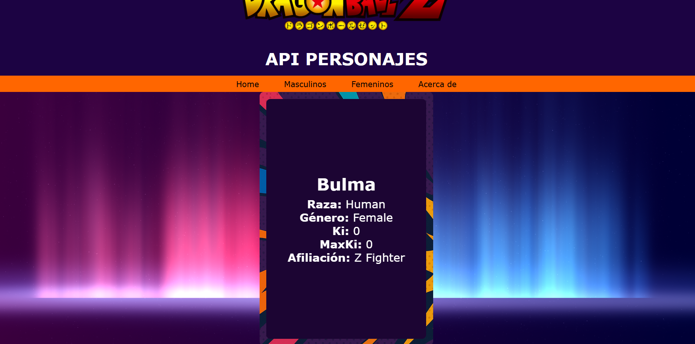

# Proyecto React + Vite: Dragon Ball Z API

Una página desarrollada en React para visualizar personajes con sistema de filtros por género, detalles individuales y una navegación fluida. Proyecto entregable para la materia de Pogramación Web.

---

## Tecnologías utilizadas

- React
- React Router DOM
- CSS personalizado
- Vite (configuración ligera de bundling)
- JavaScript

---

## Funcionalidades

- Navegación entre páginas con React Router
- Filtros por género (Masculinos y Femeninos)
- Vista detallada de cada personaje
- Paginación funcional
- Página de error personalizada
- Diseño responsive y estilizado

---

## Capturas

### Página principal (Home)


### Filtro por género


### Detalle de personaje



### Página de error


---

## Estructura del proyecto
```bash
src/
├── assets/
├── Components/
│   ├── CardCharacter/
│   ├── CharacterDetail/
│   ├── Footer/
│   ├── Header/
│   ├── NavBar/
│   └── PaginationC/
├── Pages/
│   ├── AcercaDe/
│   ├── DetailsPage/
│   ├── ErrorPage/
│   ├── FilterPage/
│   └── HomePage/
├── App.jsx
├── main.jsx
└── App.css
```
## Instalación Local

### 1. Clona este repositorio
https://github.com/Yinna-Gomez/WebG1SegundoProducto.git

### 2. Ingresar a la carpeta
cd WebG1SegundoProducto

### 3. Instala las dependencias:
npm install

### 4. Ejecuta el servidor local
npm run dev

## Autores
- Yinna Gomez Mendoza (S:P.C.) – Desarrollador principal  
- Proyecto del Grupo G1 - Programación Web
